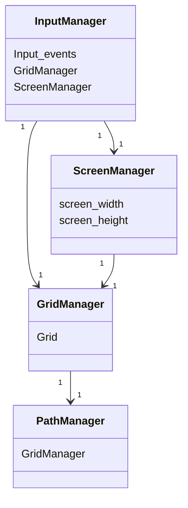
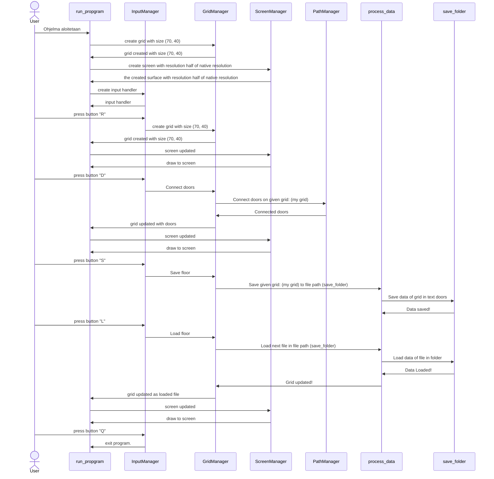

# Arkkitehtuurikuvaus

## Rakenne

Ohjelman rakenne noudattelee kolmitasoista kerrosarkkitehtuuria, ja koodin pakkausrakenne on seuraava:

Projektin arkkitehtuuri on varsin yksinkertainen, sillä projekti on vielä alussa.

Ruudukkomanageri on projektin sydän ja hoitaa lähes kaiken relevantin logiikan.

Polkumanageri vastaa huoneita yhdistävien polkujen luomisesta, ja vastaa aina ruudukkomanagerille.

Näyttömanageri hoitaa annetun ruudukon piirtämisen näytölle. Tätä varten sille annetaan Ruudukkomanagerin tiedot luettaviksi.

Näppäimistömanageri pystyy vaikuttamaan ruudukkomanageriin ja näyttömanagerin fullscreen muuttujaan. Pystyy myös sulkemaan sovelluksen.

## Luokkadiagrammi

## Toiminta kaavio

Seuraava kaavio kuvaa suurimman osan ohjelman toiminnallisuudesta, Ohjelman osat kommunikoivat toistensa kanssa nputManageri luokan ohjeiden mukaan.
Käyttäjä ohjaa ohjelmaa näppäinkomennoilla jotka löytyvät ohjetiedostosta, jossa niihin ja niiden toimintaan voi perehtyä: 
[Ohje](https://github.com/GlobalYam/AarninOlioSimulaattori-Python/blob/main/dokumentaatio/guide.md)

